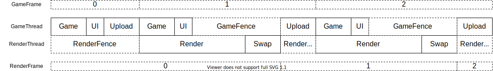

# BraneEngineDx
DirectX version of BraneEngine.

## Execution Root Folder Layout
```
├─Content
│  └─...
├─Engine
│  ├─Banner
│  ├─Fonts
│  ├─Icons
│  ├─LUTS
│  ├─Shaders
│  │  ├─Default
│  │  ├─lib
│  │  └─PostProcess
│  ├─Shapes
│  ├─SkySphere
│  └─Textures
├─BraneEngineDx.exe
├─Config.ini
├─ALUT.dll
├─NvCloth_x64.dll
├─OpenAL32.dll
├─PhysX_64.dll
├─PhysXCommon_64.dll
├─PhysXCooking_64.dll
├─PhysXDevice64.dll
├─PhysXFoundation_64.dll
└─PhysXGpu_64.dll
```
* Content Folder: place user assets. Demo content folder is at 'BraneEngineDx/Context'

* Engine Folder: Engine default resource. The default Engine folder can be found at 'BraneEngineDx/Engine'

* Config.ini: default configure file. PS: user can assgin custom config file by execution argument.

* *.dll: all the dll file can be found in 'BraneEngineDx/ThirdParty' folder.

## Multithread Rendering
